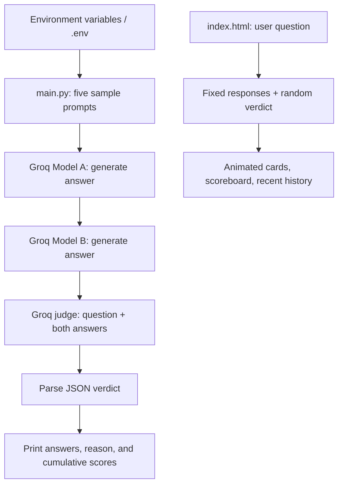

# ⚔️ LLM Battle Arena

Compare two language models on the same question, then ask a third model to judge their answers.


## 🚀 Overview

LLM Battle Arena is a small implementation of **LLM-as-a-Judge** for exploring answer quality. It includes a Python command-line evaluator and an interactive web demo.

| Entry point | What it does | Requirements |
| --- | --- | --- |
| [`main.py`](main.py) | Sends five sample questions to two Groq-hosted models, asks a judge model to choose a winner, and prints final scores. | Python, installed dependencies, a Groq API key, and accessible model IDs. |
| [`index.html`](index.html) | Demonstrates the comparison interface, verdicts, scoreboard, and recent history. | A modern browser; internet access for external styles and fonts. |

**The browser demo runs independently of Python.** Its responses are fixed example text, and its verdicts are selected randomly. It does not call Groq or evaluate the submitted question. The Python script contains the real model integration.


*The browser demo before the first battle.*

[Features](#-key-features) · [AI evaluation](#-aiml-capabilities) · [Architecture](#-architecture--workflow) · [Showcase](#-project-showcase) · [Setup](#-installation--setup) · [Run](#-how-to-run) · [Configuration](#-configuration) · [Limitations](#-limitations--requirements)

## ✨ Key features

| Python evaluator | Browser demo |
| --- | --- |
| Two candidate models and a separately configured judge. | Side-by-side response cards with simultaneous typewriter animations. |
| A shared question and explicit evaluation criteria. | Nonempty question validation and duplicate-battle prevention. |
| JSON verdict with a winner and short explanation. | Model A, Model B, and tie verdict displays. |
| Per-question answers, judgments, and cumulative win counts. | Animated win counters, total battles, and a comparison bar. |
| Fallback handling for completion errors and invalid judge JSON. | Five most recent battles, timestamps, and a score/history reset. |

## 🧠 AI/ML capabilities

The evaluator uses LlamaIndex's `Groq` adapter for **all three model roles**. Each is initialized with `temperature=0.0`. This is inference and prompt-based evaluation; the repository contains no model training, fine-tuning, retrieval pipeline, or dataset benchmark.

For each question, the judge receives the original prompt and both answers. Its instructions prioritize:

| Priority | Criterion | Intended focus |
| --- | --- | --- |
| 1 | Correctness | Accuracy of the answer. |
| 2 | Completeness | Coverage of the question. |
| 3 | Clarity | Ease of understanding. |
| 4 | Safety and best practices | Appropriate, responsible guidance. |

The judge is asked to return `winner` (`A`, `B`, or `tie`) and `reason`. The script strips surrounding Markdown code fences, parses JSON, and counts one point for each win. Ties add no points. There are no numeric scores for individual criteria.

## 🏗️ Architecture & workflow



**Python:** questions run one at a time. For each question, Model A, Model B, and the judge are called sequentially. A successful five-question run makes 15 completion calls, before any retries performed by dependencies.

**Browser:** JavaScript handles input, animation, random outcome selection, and in-memory state. There is no HTTP API connecting the demo to the evaluator and no database.

## 🛠️ Tech stack

| Component | Technology | Role |
| --- | --- | --- |
| Runtime | Python 3.10+ | Command-line evaluation. |
| LLM framework | `llama-index==0.14.13` | LlamaIndex dependencies. |
| Model adapter | `llama-index-llms-groq==0.4.1` | Groq-hosted completions. |
| Supporting adapter | `llama-index-llms-openai==0.6.13` | Pinned dependency; the application configures only Groq models. |
| Environment loading | `python-dotenv==1.2.1` | Loads local `.env` configuration. |
| Interface | HTML, Tailwind CSS CDN, vanilla JavaScript | Responsive layout, animations, and demo state. |
| Typography | Google Fonts / Inter | Browser UI font. |
| Automation | GitHub Actions | Installs dependencies and runs `main.py` on pushes and pull requests to `main`. |

## 📸 Project showcase

These six screenshots, including the overview above, are captures of the existing browser demo. The displayed answers, explanations, and win counts illustrate its UI behavior; they are not model evaluation results.

### Question entry


*A sample question ready for the Battle button. The demo records the question in history while displaying its fixed example responses.*

### Verdict states

<table>
  <tr>
    <th>Model A wins</th>
    <th>Model B wins</th>
  </tr>
  <tr>
    <td></td>
    <td></td>
  </tr>
  <tr>
    <td>A green verdict highlights Model A and its preset explanation.</td>
    <td>A cyan verdict highlights Model B and its preset explanation.</td>
  </tr>
</table>

<details>
<summary>View the tie verdict</summary>


*A tie uses a neutral verdict style and leaves both win counters unchanged.*

</details>

### Scoreboard & recent history


*Win totals accumulate during the current page session. History shows the five latest questions, outcomes, and timestamps; Reset Scores clears both scores and history.*

## ⚙️ Installation & setup

### Prerequisites

- **For Python evaluation:** Python 3.10 or newer, `pip`, internet access, and a Groq API key with access to the model IDs you configure. The existing CI targets Python 3.10; the local environment used to check these instructions is Python 3.13.
- **For the browser demo:** a modern browser. No API key, Python packages, or frontend build step is needed when opening the HTML file directly.

### Clone the repository

```bash
git clone https://github.com/vinayak533/llm-battle-arena.git
cd llm-battle-arena
```

### Set up Python

**Windows PowerShell**

```powershell
python -m venv venv
.\venv\Scripts\Activate.ps1
python -m pip install -r requirements.txt
```

If local policy prevents script activation, use the virtual environment's interpreter directly:

```powershell
.\venv\Scripts\python.exe -m pip install -r requirements.txt
```

**macOS / Linux**

```bash
python3 -m venv venv
source venv/bin/activate
python -m pip install -r requirements.txt
```

Create or update `.env` in the repository root using the variables below. There is no `.env.example` file in this repository.

## 🔧 Configuration

| Variable | Required for Python | Purpose |
| --- | --- | --- |
| `GROQ_API_KEY` | Yes | Authenticates requests to Groq. |
| `LLM_A` | Yes | Exact Groq model ID for candidate A. |
| `LLM_B` | Yes | Exact Groq model ID for candidate B. |
| `JUDGE_LLM` | Yes | Exact Groq model ID for the evaluator. |

```dotenv
GROQ_API_KEY=replace_with_your_groq_api_key
LLM_A=replace_with_an_accessible_groq_model_id
LLM_B=replace_with_another_accessible_groq_model_id
JUDGE_LLM=replace_with_an_accessible_groq_judge_model_id
```

The values above are **placeholders**, not runnable model IDs. Obtain your key and confirm model access in the [Groq console](https://console.groq.com/). Keep credentials local and do not commit API keys.

`load_dotenv()` loads `.env`; existing process environment variables take precedence. The script provides no default model IDs. Temperature is fixed in `main.py`, and questions are defined in its `test_prompts` list. Changing `.env` does not affect the browser demo.

## ▶️ How to run

### Real model evaluation

From the repository root, with the virtual environment activated and configuration completed:

```bash
python main.py
```

Without activation on Windows:

```powershell
.\venv\Scripts\python.exe main.py
```

The terminal prints each question, Answer A, Answer B, the judge's winner and reason, then final scores and an overall winner or tie. There is no interactive CLI prompt or command-line argument parser.

### Browser demo

Open [`index.html`](index.html) from your local checkout in a browser. Alternatively, with Python available, serve the project locally:

```bash
python -m http.server 8000 --bind 127.0.0.1
```

Visit [http://127.0.0.1:8000/index.html](http://127.0.0.1:8000/index.html). This serves static files; it does not connect the UI to Groq. Stop the server with `Ctrl+C`.

## 💡 Usage examples

**Try the interface:** enter `Explain AWS IAM in simple terms`, click **Battle**, and wait for both animated responses and the verdict. Repeat to populate the scoreboard and recent history, then click **Reset Scores**. Outcomes vary randomly, even for the same question.

**Run the included evaluation:** `python main.py` compares answers to five beginner-oriented questions covering AWS IAM, security groups versus NACLs, Docker, CI/CD, and Kubernetes.

**Evaluate your own questions:** edit `test_prompts` in `main.py`, then rerun the script. For example:

```python
test_prompts = [
    "Explain AWS IAM in simple terms",
    "Difference between Security Group and NACL",
    "What is Docker and why is it used",
]
```

To compare a different pair of models, update `LLM_A` and `LLM_B` while keeping the same questions and judge configuration. Results are printed to the terminal; saving or exporting them is not implemented.

## 📂 Project structure

```text
llm-battle-arena/
├── .github/
│   └── workflows/
│       └── gg.yml              # Dependency installation and script execution
├── images/
│   ├── 01-arena-overview.png
│   ├── 02-question-ready.png
│   ├── 03-model-a-demo-verdict.png
│   ├── 04-model-b-demo-verdict.png
│   ├── 05-tie-demo-verdict.png
│   └── 06-scoreboard-and-battle-history.png
├── index.html                  # Standalone simulated browser demo
├── main.py                     # Groq generation, judging, and terminal scores
├── requirements.txt            # Pinned direct Python dependencies
└── README.md
```

Local setup also uses `.env` for configuration and `venv/` for the Python environment.

## 🛡️ Limitations & requirements

- **Model availability:** a valid key and accessible model IDs are required. Existing model settings are not guaranteed to work for your account; an unavailable model produces a provider error. The screenshots demonstrate only the browser demo.
- **Failure reporting:** generation exceptions become `Error in response`. Judge exceptions or invalid JSON become a tie with `Judge failed` or `Invalid JSON from judge`. A zero-score tie or exit code `0` can therefore accompany failed API calls; inspect the printed errors and reasons.
- **Output validation:** valid JSON is parsed without schema validation. Missing keys, an unexpected JSON type, or an unsupported winner value are not comprehensively handled.
- **Evaluation scope:** one judge supplies a qualitative preference. There are no reference answers, repeated trials, bias controls, or statistical confidence estimates. Win counts alone do not establish model quality.
- **Temporary state:** Python scores reset on each run. Browser scores and history reset on reload; only the latest five battles are retained. Reset Scores leaves the latest response cards and verdict visible.
- **Demo dependencies:** Tailwind CSS and Inter load from external services. The page needs network access for its intended styling and font; it has no build pipeline or live inference integration.
- **Automation scope:** the GitHub Actions workflow runs the script against its configuration. It contains no test assertions and does not establish that model requests succeeded.

## 🗺️ Possible next steps

These are development ideas, not implemented capabilities or committed milestones:

- Connect the browser to the evaluator through a server-side API that keeps credentials off the client.
- Validate configuration and judge output, and distinguish failed evaluations from genuine ties.
- Accept questions through CLI arguments or input files and export results for later review.
- Add persistent history, controlled evaluation datasets, and tests that do not require live API access.

---

Built by [Vinayak](https://github.com/vinayak533).
