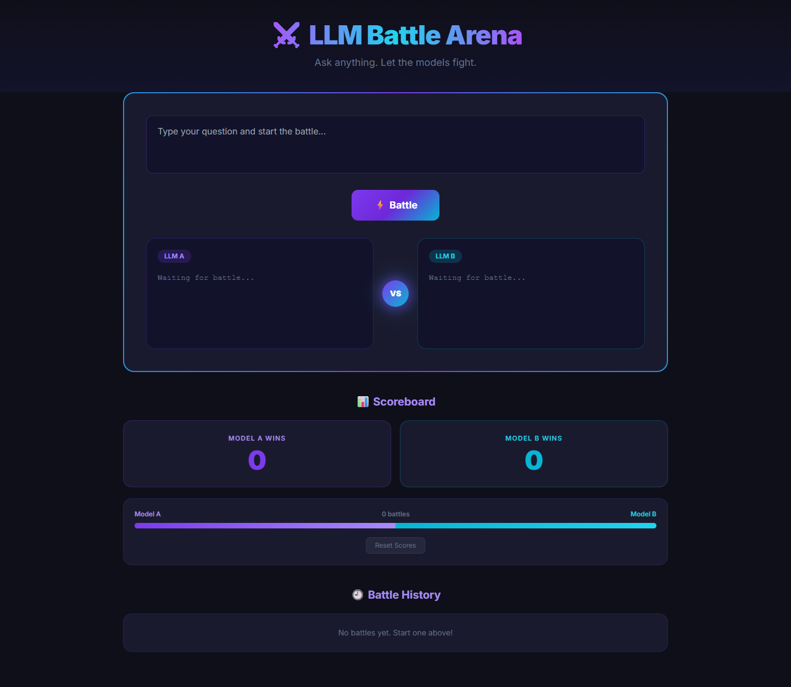
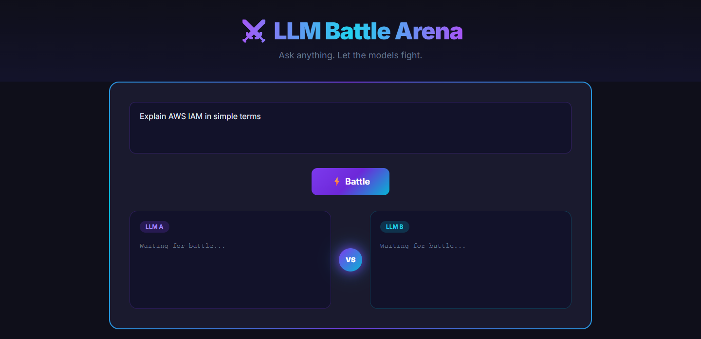
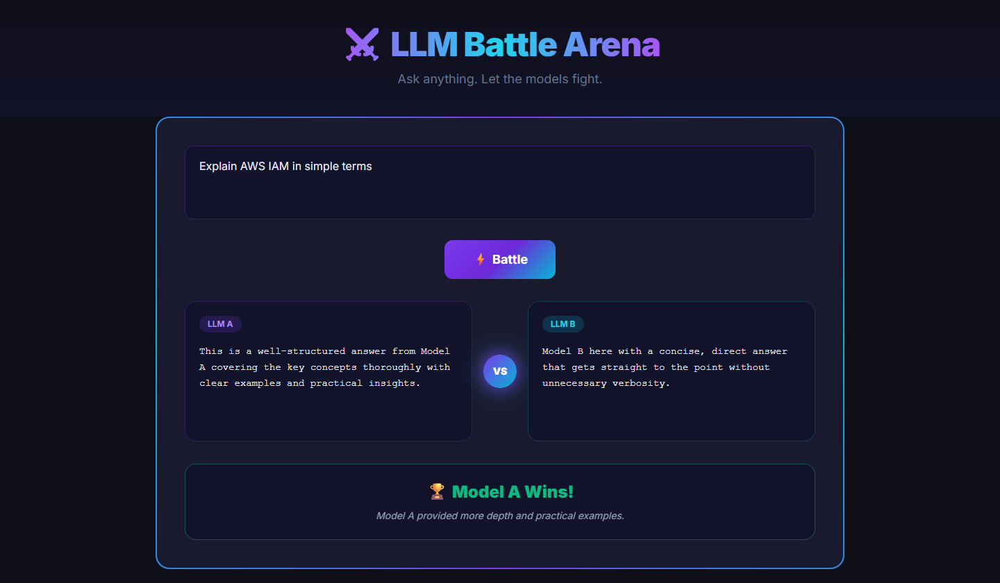
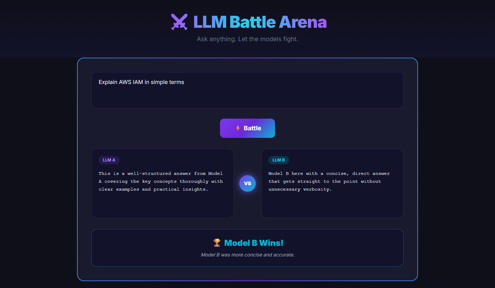
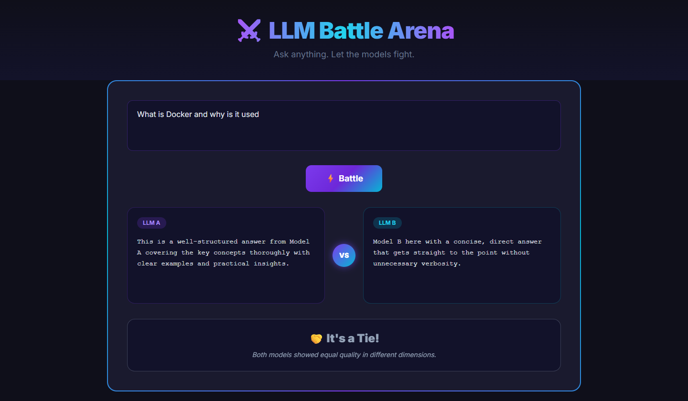
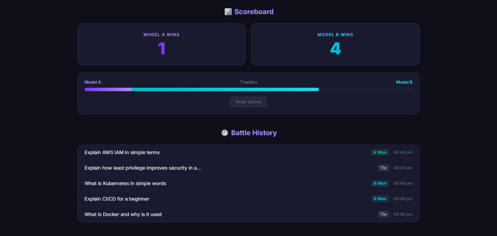
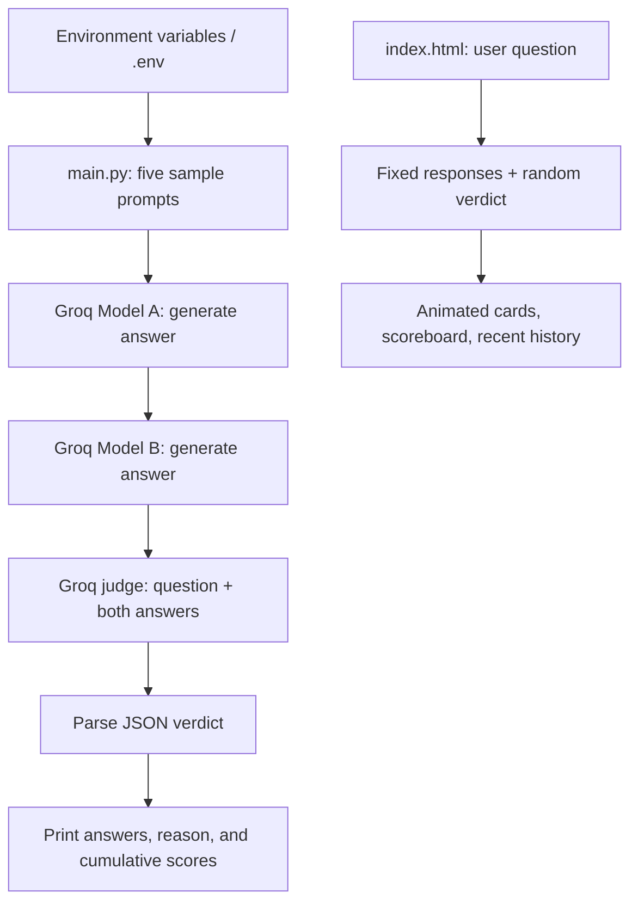

<div align="center">

<h1>⚔️ LLM Battle Arena</h1>

<p>Compare two language models on the same question with a configurable AI judge, a clear evaluation rubric, and reasoned verdicts.</p>

<p>
  
  
  
  
  <a href="https://github.com/vinayak533/llm-battle-arena/actions/workflows/gg.yml"></a>
</p>



<p><sub>Standalone browser demo before the first battle. Live model evaluation runs through the Python CLI.</sub></p>

<p>
  <a href="#demo--screenshots">Demo</a> |
  <a href="#docs">Docs</a> |
  <a href="#architecture">Architecture</a> |
  <a href="#getting-started">Quickstart</a>
</p>

</div>

<a id="docs"></a>
<details>
<summary>Documentation contents</summary>

- [The problem and the solution](#the-problem-and-the-solution)
- [Key features](#key-features)
- [Demo / Screenshots](#demo--screenshots)
- [Architecture](#architecture)
- [Tech stack](#tech-stack)
- [Engineering highlights](#engineering-highlights)
- [Getting started](#getting-started)
- [Project structure](#project-structure)
- [Testing and quality](#testing-and-quality)
- [Roadmap](#roadmap)
- [Author](#author)
- [License and acknowledgements](#license-and-acknowledgements)

</details>

## The problem and the solution

Comparing LLM answers requires a shared question, explicit criteria, and a reason for preferring one response.
LLM Battle Arena sends the same prompt to two Groq-hosted models, then asks a separately configured judge to return a winner and explanation.
The Python evaluator prints answers, judgments, and cumulative wins; the browser demo makes the comparison workflow easy to explore.

**The browser uses fixed example answers and random verdicts. It runs independently of Python and does not evaluate submitted questions.**

<a id="key-features"></a>

## ✨ Key features

- **Three configurable model roles:** select candidate A, candidate B, and the judge through environment variables without changing the evaluation loop.
- **An explicit judging rubric:** prioritize correctness, completeness, clarity, then safety and best practices, so each verdict has a stated basis.
- **Inspectable evaluation output:** print both answers, the judge's `winner` and `reason`, and final win counts; each win adds one point and ties add none.
- **Completion and JSON error handling:** report generation failures and return documented judge fallbacks, making errors visible in terminal output.
- **Coordinated browser interactions:** reject empty questions, prevent duplicate battle starts, and animate both response cards simultaneously.
- **Session summaries:** display animated win counters, total battles, a comparison bar, and the five most recent questions with outcomes and timestamps.
- **A browser demo without an install step:** open one HTML file to explore A, B, and tie verdicts, with responsive layouts and a score/history reset.

<p align="center">
  
  <br><sub>Question entry: the demo records your question in history while displaying its fixed example responses.</sub>
</p>

<a id="demo--screenshots"></a>

## 📸 Demo / Screenshots

These are captures of the existing browser demo. Answers, explanations, and scores illustrate interface behavior; they are simulated evaluation outcomes.

<table>
  <tr>
    <th>Model A wins</th>
    <th>Model B wins</th>
  </tr>
  <tr>
    <td></td>
    <td></td>
  </tr>
  <tr>
    <td>Green styling highlights A and its explanation.</td>
    <td>Cyan styling highlights B and its explanation.</td>
  </tr>
  <tr>
    <th>Tie verdict</th>
    <th>Scoreboard and recent history</th>
  </tr>
  <tr>
    <td></td>
    <td></td>
  </tr>
  <tr>
    <td>A neutral tie leaves both win counters unchanged.</td>
    <td>Scores accumulate during the page session; history retains the latest five battles.</td>
  </tr>
</table>

Try `Explain AWS IAM in simple terms`, click **Battle**, and wait for the responses and verdict. Repeat to populate history, then click **Reset Scores**. Outcomes vary randomly, including for repeated questions.
Reset clears scores and history while leaving the latest response cards and verdict visible. Reloading starts a fresh session.

<a id="architecture"></a>

## 🏗️ Architecture



- **One provider adapter:** LlamaIndex's `Groq` adapter handles all three roles, each initialized with `temperature=0.0`; model selection comes from configuration.
- **Sequential evaluation:** questions run one at a time, with A, B, then the judge. A successful five-question run makes 15 completion calls, before any dependency retries.
- **Independent entry points:** the CLI performs inference; static HTML and vanilla JavaScript handle the demo. There is no HTTP API connecting them.
- **In-memory state:** Python scores reset on each run; browser scores and history reset on reload. No database or result export is implemented.
- **Simple frontend delivery:** Tailwind CSS and Inter load externally, avoiding a frontend build step while requiring network access for the intended styling and font.

<a id="tech-stack"></a>

## 🛠️ Tech stack

| Area | Technology | Purpose |
| --- | --- | --- |
| Frontend | HTML, vanilla JavaScript, Tailwind CSS CDN | Responsive demo, typewriter animations, verdicts, and session state. |
| Frontend | Google Fonts / Inter | Interface typography. |
| Backend | Python 3.10+ | Command-line generation, judging, and score aggregation. |
| Backend | `python-dotenv==1.2.1` | Load local `.env` configuration. |
| AI / ML | `llama-index==0.14.13` | LlamaIndex framework dependencies. |
| AI / ML | `llama-index-llms-groq==0.4.1` | Application adapter for Groq-hosted completions. |
| AI / ML | `llama-index-llms-openai==0.6.13` | Pinned supporting dependency; application model roles use Groq. |
| Data | Python counters; JavaScript counters and history array | Temporary scores and the latest five browser battles. |
| Infra | Groq API | Hosted inference for the Python evaluator. |
| DevOps | GitHub Actions | Dependency installation and script execution on pushes and pull requests to `main`. |

The AI workflow is inference and prompt-based evaluation. Model training, fine-tuning, retrieval pipelines, and dataset benchmarks are not implemented.

## Engineering highlights

| Problem | Approach | Verifiable result |
| --- | --- | --- |
| Model preferences need an explicit basis. | Give the judge the original question, both answers, and ordered evaluation criteria. | Each parsed verdict carries a winner and explanation; wins accumulate independently for A and B. |
| Judge output can contain Markdown or invalid JSON. | Strip surrounding code fences before `json.loads`; catch parsing and completion errors. | Fenced JSON is accepted; malformed JSON and judge exceptions return distinct fallback reasons. |
| Repeated clicks can overlap a browser battle. | Guard entry with `battling`, block button interaction, and await both typewriters with `Promise.all`. | Duplicate battle starts are ignored; the verdict and score update follow completion of both responses. |
| Browser history can grow with repeated use. | Insert newest entries first, cap history at five, and truncate question snippets after 50 characters. | The UI retains a bounded, timestamped history and supports a score/history reset. |

<details>
<summary>Evaluation boundaries and failure semantics</summary>

- **Rubric, not criterion scores:** the priorities are correctness, completeness, clarity, and safety/best practices. The judge returns `winner` (`A`, `B`, or `tie`) and `reason`; individual criteria receive no numeric scores.
- **Failures can resemble ties:** generation exceptions return `Error in response`. Judge exceptions return a tie with `Judge failed`; invalid JSON returns a tie with `Invalid JSON from judge`. Inspect printed errors and reasons: a 0–0 tie or exit code `0` can accompany failed API calls.
- **JSON parsing is not schema validation:** missing keys, unexpected JSON types, and unsupported winner values are not comprehensively handled.
- **One judge provides a qualitative preference:** there are no reference answers, repeated trials, bias controls, or statistical confidence estimates. Win counts alone do not establish model quality.
- **Model access is account-dependent:** the CLI requires a valid API key and accessible model IDs. Unavailable models produce provider errors; the screenshots demonstrate the browser demo.

</details>

<a id="getting-started"></a>

## 🚀 Getting started

**Prerequisites:** Git to clone; a modern browser for the demo. Python evaluation additionally needs Python 3.10+, `pip`, internet access, and a Groq API key with access to your chosen model IDs.
The browser needs internet access for styles and fonts; it needs no API key or Python dependencies.

```bash
git clone https://github.com/vinayak533/llm-battle-arena.git
cd llm-battle-arena
```

### Run the browser demo

Open [`index.html`](index.html) directly in your browser. With Python available, you can also serve it locally:

```bash
python -m http.server 8000 --bind 127.0.0.1
```

On macOS/Linux, use `python3` if `python` is unavailable. Visit [http://127.0.0.1:8000/index.html](http://127.0.0.1:8000/index.html); stop the server with `Ctrl+C`.
This is a static file server. It does not connect the demo to Groq.

### Run the Python evaluator

Install the pinned dependencies in a virtual environment. Direct interpreter paths work without shell activation.

**Windows PowerShell**

```powershell
python -m venv venv
.\venv\Scripts\python.exe -m pip install -r requirements.txt
```

**macOS / Linux**

```bash
python3 -m venv venv
venv/bin/python -m pip install -r requirements.txt
```

Create or update `.env` in the repository root. No `.env.example` is shipped. Fill the following variables with your own values; keep credentials local and do not commit API keys.

```dotenv
GROQ_API_KEY=
LLM_A=
LLM_B=
JUDGE_LLM=
```

| Variable | Required | Value to supply |
| --- | --- | --- |
| `GROQ_API_KEY` | Yes | Your Groq API key. |
| `LLM_A` | Yes | Accessible Groq model ID for candidate A. |
| `LLM_B` | Yes | Accessible Groq model ID for candidate B. |
| `JUDGE_LLM` | Yes | Accessible Groq model ID for the judge. |

Obtain a key and confirm model access in the [Groq console](https://console.groq.com/). Empty values above are placeholders, not runnable configuration.
`load_dotenv()` loads `.env`; existing process environment variables take precedence. There are no default model IDs. Configuration changes apply to Python; the browser demo remains independent.

**Windows PowerShell**

```powershell
.\venv\Scripts\python.exe main.py
```

**macOS / Linux**

```bash
venv/bin/python main.py
```

The CLI runs five beginner-oriented questions covering AWS IAM, security groups versus NACLs, Docker, CI/CD, and Kubernetes. It prints each question, both answers, the winner and reason, then final scores and an overall winner or tie.
There is no interactive prompt or argument parser. Results go to the terminal; saving or exporting them is not implemented.

<details>
<summary>Optional environment activation and custom questions</summary>

You can activate the environment before using `python` directly. On Windows, direct interpreter paths above also work if local policy prevents script activation.

```powershell
.\venv\Scripts\Activate.ps1
python main.py
```

```bash
source venv/bin/activate
python main.py
```

Edit `test_prompts` in [`main.py`](main.py) to evaluate your own questions, then rerun:

```python
test_prompts = [
    "Explain AWS IAM in simple terms",
    "Difference between Security Group and NACL",
    "What is Docker and why is it used",
]
```

To compare different candidates, change `LLM_A` and `LLM_B` while retaining the same questions and judge configuration. Temperature is fixed in `main.py`.

</details>

## Project structure

```text
llm-battle-arena/
├── .github/workflows/
│   └── gg.yml           # Install dependencies and run the evaluator in CI
├── images/              # Six browser screenshots used in this README
├── index.html           # Standalone demo: input, animations, verdicts, and history
├── main.py              # Groq candidate generation, judging, and terminal scores
├── requirements.txt     # Four pinned direct Python dependencies
└── README.md            # Project overview, architecture, and setup
```

Local configuration uses `.env`; setup creates `venv/` for the Python environment.

<a id="testing-and-quality"></a>

## ✅ Testing and quality

Run dependency and Python syntax checks with your virtual environment's interpreter.

**Windows PowerShell**

```powershell
.\venv\Scripts\python.exe -m pip check
.\venv\Scripts\python.exe -m py_compile main.py
```

**macOS / Linux**

```bash
venv/bin/python -m pip check
venv/bin/python -m py_compile main.py
```

**CI:** [`.github/workflows/gg.yml`](.github/workflows/gg.yml) runs on Ubuntu with Python 3.10 for pushes and pull requests to `main`. It installs dependencies and executes `main.py`; it contains no test assertions and cannot establish that model requests succeeded.
There is no checked-in automated test suite, linter configuration, or type-check configuration.

**Verification:** the four pinned direct dependencies and `pip check` passed locally on Python 3.13.3. Offline checks exercised the 15-call sequence, fenced-JSON parsing, win aggregation, and error fallbacks. The static demo and all six screenshot URLs returned HTTP 200.

Manual checks during screenshot capture covered empty/whitespace input, duplicate clicks, both typewriter responses, all three verdicts, animated counts, totals and progress, latest-first history, the five-entry cap, long-question truncation, reset, and reload behavior.

<a id="roadmap"></a>

## 🗺️ Roadmap

Completed capabilities and proposed next steps:

- [x] Implement the three-role CLI evaluator and the browser verdict, scoreboard, and history demo.
- [ ] Connect the browser to a server-side evaluation API that keeps credentials off the client.
- [ ] Validate configuration and verdict schemas; distinguish failed evaluations from genuine ties.
- [ ] Accept questions through CLI arguments or input files and export results for later review.
- [ ] Add persistent history, controlled evaluation datasets, and automated tests that do not require live API access.

## Author

**Vinayak** · [GitHub](https://github.com/vinayak533)

<!-- TODO: add your current professional role and verified LinkedIn, portfolio, and public email links. -->

Looking for AI/ML engineering roles.

## License and acknowledgements

No license file is included in this repository.

<!-- TODO: choose a license and add a LICENSE file. -->

Built with LlamaIndex, Groq, python-dotenv, Tailwind CSS, and the Inter typeface.
